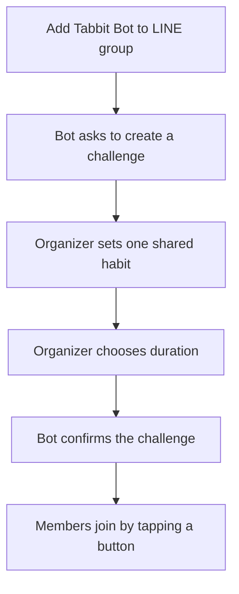
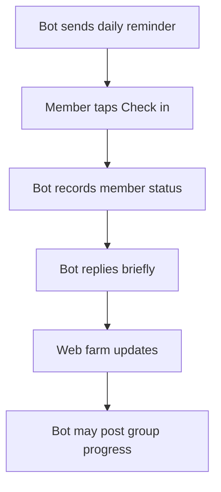
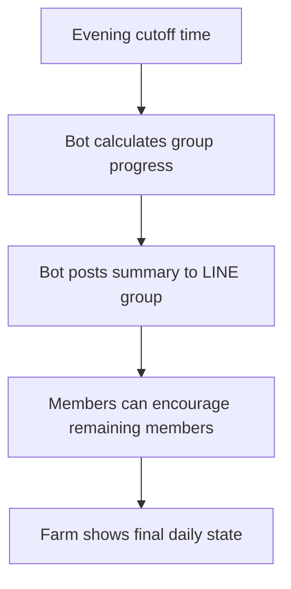

# MVP Product Flow: LINE-First Rabbit Farm

## Product Thesis

Tabbit is a LINE-first group habit accountability product. LINE is where the daily loop happens. The web app is where the group sees a cozy rabbit farm that reflects shared consistency.

The farm is not a full game. It is an emotional progress surface that makes group momentum visible and makes users want to return tomorrow.

## Core Loop

```text
Add Tabbit Bot to LINE group
-> Create one shared habit challenge
-> Daily LINE reminder
-> Members check in
-> Bot posts group progress
-> Members encourage each other
-> Web farm reflects today's group energy
-> Return tomorrow
```

## MVP Positioning

```text
Tabbit helps small groups build consistency by turning daily check-ins into a shared rabbit farm.
```

The reference mood is cozy, soft, and lightweight, inspired by the feeling of games like Cat & Soup, without copying the product mechanics or turning Tabbit into an idle game.

## Primary Surfaces

### 1. LINE Group

LINE is the main behavior surface.

Core actions:

- Create or connect a Tabbit challenge
- Send daily reminders
- Check in with a button or short command
- Post lightweight progress updates
- Invite encouragement from the group

Example messages:

```text
Morning reminder:
Today's reading habit is open.
Tap check-in when you are done: [Check in]

Progress update:
The farm is active today: 4/6 rabbits are out.
Two are still resting. Send them a little encouragement?

Completion moment:
Everyone checked in today. The farm is full of energy.
```

### 2. Web App Dashboard

The web app is the visual progress surface.

Core sections:

- Rabbit farm scene
- Today's group progress
- Member status
- Encouragement actions
- Challenge history

The dashboard should be useful even if the user only opens it for a few seconds.

## Rabbit Farm Concept

### Mapping

| Product Event | Farm Visualization |
| --- | --- |
| Member joins challenge | A new rabbit appears in the farm |
| Member checks in today | That rabbit comes out and moves around |
| Member has not checked in | Rabbit rests in a house or quiet area |
| Member receives encouragement | Small hearts or sparkles appear near the rabbit |
| Group reaches high participation | Farm becomes more lively |
| Everyone checks in | A small happy moment plays |
| Group stays consistent over days | Plants, carrots, or small farm details gradually grow |

### Visual Rules

- One rabbit = one member
- Farm state = group momentum
- Check-in is the primary behavior
- Encouragement is a supportive bonus
- Missed check-ins should never feel like punishment

### Mood

- Cozy illustrated rabbit farm
- Warm, clean, simple, soft motion
- Rabbits move lightly: hop, walk, rest, eat carrots
- Farm feels alive but not noisy
- UI stays simple and readable

## Scoring Model

Do not lead with "points" in MVP copy. Use softer language such as:

- Farm energy
- Today's farm activity
- Group progress
- Consistency

### MVP Formula

```text
daily_group_progress = checked_in_members / active_members
```

Optional supportive signal:

```text
encouragement_count = reactions or encouragement actions sent today
```

Encouragement can affect visual polish, but it should not outrank check-ins.

## LINE Bot Flow

### Create Challenge



### Daily Check-In



### End-Of-Day Summary



## Notification Cadence

Start conservative to avoid spam.

- Morning reminder: once per day
- Progress update: only after meaningful movement, or once at midday
- Evening summary: once per day
- Encouragement prompt: only when it feels supportive, not accusatory

Avoid tagging specific people in MVP unless user tests show it feels acceptable.

## MVP Scope

### Build

- LINE bot can be added to a group
- Group can create one active challenge
- Members can join the challenge
- Members can check in daily
- Bot posts reminder and summary messages
- Web dashboard shows rabbit farm visualization
- Rabbit state reflects today's check-in status
- Basic encouragement action
- Simple challenge history

### Keep Simple

- One active shared habit per group
- Small groups first
- One daily check-in per member
- One farm scene style
- No complex customization

## Non-Goals

Do not build these in MVP:

- Coin economy
- Shop
- Gacha
- Crafting
- Idle earning
- Leaderboard
- Complex pet stats
- Multiple simultaneous habits per group
- Public community discovery
- Advanced admin controls
- Heavy notification settings

## Success Metrics

Primary:

- Day 7 group retention
- Daily check-in rate
- Percentage of groups with at least 3 active members

Secondary:

- Dashboard open rate after LINE summary
- Encouragement actions per group per week
- Challenge completion rate
- Groups that start a second challenge

## Key Risks

- The farm may be cute but not improve retention.
- LINE messages may become noisy and cause groups to mute the bot.
- Members who miss check-ins may feel exposed if the design is too direct.
- LINE integration may slow MVP development compared with a manual test.

## Validation Plan

Before building full automation, test the loop manually in one or two LINE groups:

1. Run a 7-day reading challenge.
2. Send daily reminder and summary messages manually.
3. Share a simple static or prototype farm dashboard.
4. Track whether the farm makes users open the dashboard and return.
5. Interview members who drop off and members who return daily.

Build the bot only after there is evidence that LINE-based reminders and group summaries improve repeat check-ins.
